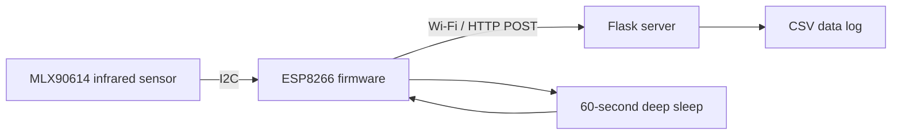

# ESP8266 Low-Power Sensor Data Logger

### Infrared temperature sensing · Wireless telemetry · Timed deep sleep

An embedded prototype that reads ambient and object temperatures from an MLX90614 infrared sensor, transmits them to a Flask server, and stores the readings in CSV. The project connects sensor interfacing, MCU firmware, networking, and a small data-logging backend.

**Stack:** C++ / Arduino · ESP8266 · I²C · HTTP / JSON · Python / Flask

[Sensor firmware](2nd%20day_Temp%20device%20with%20IR/IRdevice_uploaded_on_esp8266.ino) · [Logging server](2nd%20day_Temp%20device%20with%20IR/server.py) · [Sample log](2nd%20day_Temp%20device%20with%20IR/data_log.csv)

## System architecture



## What the published code implements

- I²C sensor initialization and ambient / object temperature acquisition.
- Static-IP Wi-Fi setup with a 10-second connection timeout.
- JSON telemetry sent to `POST /api/sensor`.
- A local web page available during a five-second debugging window.
- 60-second deep sleep, including sensor-initialization and Wi-Fi failure paths.
- Server-side UTC / KST timestamps, CSV logging, and `GET /api/latest`.

## Hardware connections

| Connection | ESP8266 pin |
| :--- | :--- |
| Sensor SDA | D2 |
| Sensor SCL | D1 |
| Timed wake-up | GPIO16 / D0 connected to RST |

Use a sensor module and power supply compatible with the board’s voltage levels, with a shared ground.

## Source map

| File | Purpose |
| :--- | :--- |
| [Wi-Fi LED example](1st%20day_Using%20MCU/blink_using_wifi.ino) | Initial Wi-Fi / GPIO experiment |
| [Sensor firmware](2nd%20day_Temp%20device%20with%20IR/IRdevice_uploaded_on_esp8266.ino) | Sensor acquisition, HTTP transmission, web debugging, sleep |
| [server.py](2nd%20day_Temp%20device%20with%20IR/server.py) | Flask ingestion API and CSV storage |
| [data_log.csv](2nd%20day_Temp%20device%20with%20IR/data_log.csv) | Sample output |

## Run the prototype

1. Install the ESP8266 board package in Arduino IDE and the Adafruit MLX90614 library with its dependencies.
2. Connect the sensor and the GPIO16-to-RST wake-up wire.
3. Configure the firmware’s Wi-Fi settings, static-IP configuration, and `SERVER_HOST` / `SERVER_PORT` for your network.
4. Start the Python server from the sensor-project directory:

```bash
cd "2nd day_Temp device with IR"
python3 -m pip install flask
python3 server.py
```

5. Upload the sensor sketch. Check `data_log.csv` or visit `http://<server-ip>:8080/api/latest`. The optional device web page is available only during its brief awake window.

Example telemetry:

```json
{"ambient_c": 23.4, "object_c": 30.2}
```

## Current scope and next steps

The published implementation measures infrared temperature and uses HTTP. Pressure sensing and MQTT are future extensions. Battery runtime has not been established by a published current measurement or long-duration test; the earlier six-month estimate is a design target.

The HTTP client currently sends data and consumes the response without checking its status code. Useful next steps are response validation, retry / buffering logic, and measured sleep / active current profiles.

## Author

[Jinwon Doo](https://github.com/DooJinWon) · Electrical Engineering
